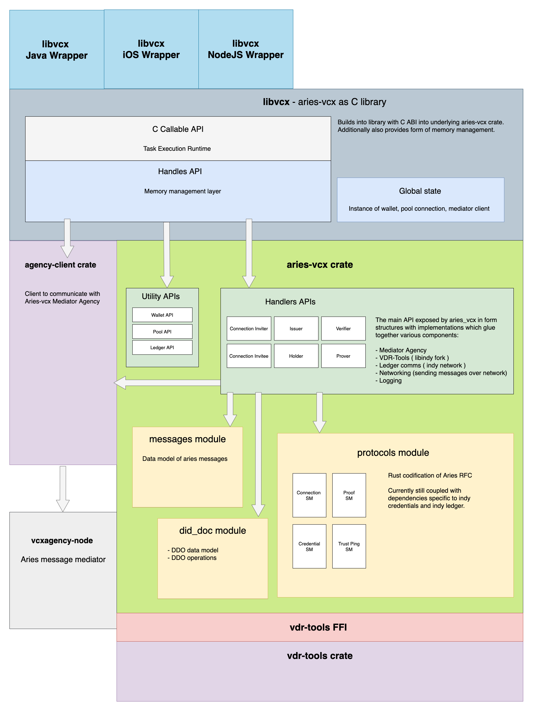

#  AriesVCX

- **aries-vcx** is Rust implementation of Aries protocols with 
  [mediator agency](https://github.com/hyperledger/aries-rfcs/blob/master/concepts/0046-mediators-and-relays/README.md) integration.
- **libvcx** is provides C-bindings and memory management on top AriesVCX, so you can harness it on
essentially any platform. Officially we support:
  - Java (+Android)
  - iOS, 
  - NodeJS
- Overview of [implemented Aries protocols](./ARIES.md)
- AriesVCX requires [mediator agency](https://github.com/hyperledger/aries-rfcs/blob/master/concepts/0046-mediators-and-relays/README.md).
  One such implementation is [NodeVCX Agency](https://github.com/AbsaOSS/vcxagencynode/). 
  For early development and experimentation, you can use agency we have deployed at 
  `https://ariesvcx.agency.staging.absa.id/agency` (instance of NodeVCX Agency)
  
# Versioning
- The project currently does not follow semantic versioning. Fow now we are releasing versions `0.x.x`. 
- Although the API is mostly stable, breaking changes still occur in our releases. See our
  [releases](https://github.com/hyperledger/aries-vcx/releases) page as our changelog.
- See our [roadmap](./ROADMAP.md).

# Get started
The best way to get your hands on.  
* Simple NodeJS [Agent](./agents/node/vcxagent-core)
* Android [demo](https://github.com/sktston/vcx-demo-android)  (3rd party demo)
* iOS [demo](https://github.com/sktston/vcx-demo-ios) (3rd party demo)
* iOS [skeleton project](https://github.com/sktston/vcx-skeleton-ios) (3rd party demo)

#### ::Important::
However before you'll be able to pick one of these demos and run them locally, you need to build binary library which
all these demos depends on.  
- [Building AriesVCX on OSX, Linux](./docs/build-general.md)

# Project architecture
The architecture is evolving - you can compare the diagram below with diagram under [roadmap](./roadmap.md).

# 

# Artifacts
Number of artifacts are built for every CI run (unless it's coming from a forked repository due to limitations of Github Actions). 
Artifacts tied with particular release can be found on 
 [release page](https://github.com/hyperledger/aries-vcx/releases).
 
## Artifacts produced:
- Alpine based docker image with precompiled `libvcx`
- iOS wrapper
- Android wrapper
- NodeJS wrapper

#### When looking for artifacts for a particular CI run:
- NodeJS wrappers are published on [npmjs](https://www.npmjs.com/package/@hyperledger/node-vcx-wrapper)
- Docker images are in [Github Packages](https://github.com/hyperledger/aries-vcx/packages)
- Mobile artifacts are attached to [CI runs](https://github.com/hyperledger/aries-vcx/actions) (click on particular CI run to
  see the artifacts)
