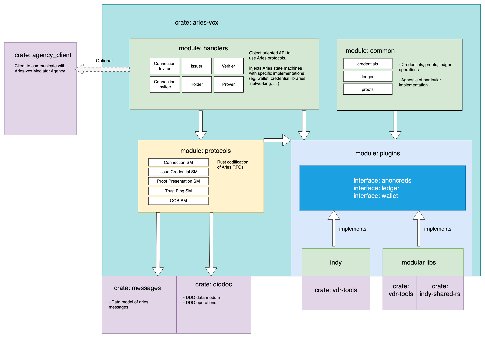

# `aries_vcx` crate

Provides basic tools to build didcomm/aries enabled application in Rust. This can include native mobile apps, or
webservers for VC issuance/verification, didcomm mediator service etc.

#### What this crate can do for you

- Create encrypted wallet.
- Read/write from/to Indy ledger.
- Establish didcomm connections and exchange messages.
- Create and process Aries messages to drive Aries protocols (especially for VC issuance and presentation).

#### What does crate does NOT DO for you

- Provide message outbounds - `aries_vcx` helps you to create correct response & encrypt it, but you have to take care
  of sending it to the right place.
- Automatic inbound processing - you have to take care of receiving messages and passing them to `aries_vcx` for processing.
  You need to keep track of your ongoing aries "conversations" and match incoming messages (typically based on message thread id).

# Getting started

To use `aries_vcx` in your project, you need to add GitHub dependency to your `Cargo.toml`, and best
define a version through a `tag`:

```toml
aries-vcx = { tag = "0.65.0", git = "https://github.com/hyperledger/aries-vcx" }
```

It's also advisable to follow these [instructions](TUTORIAL.md) to check your environment is properly configured.

# Projects built with aries-vcx

- [mediator](../agents/rust/mediator) - Message mediator web service, useful for mobile device to receive messages while the device is offline.
- [unifii_aries_vcx](../../uniffi_aries_vcx) - Mobile wrapper to autogenerate Swift and Kotlin wrappers. Also comes with sample native mobile app.
- [aries-vcx-agent](../agents/rust/aries-vcx-agent) - Sample agent framework adding persistence and message matching on top of `aries_vcx`. Used for cross-compatibility testing with other aries implementations.

## Implemented Aries protocols

- ✅ Connection Protocol 1.0: [`https://didcomm.org/connections/1.0/*`](https://github.com/hyperledger/aries-rfcs/tree/master/features/0160-connection-protocol)
- ✅ Out of Band 1.1: [`https://didcomm.org/out-of-band/1.1/*`](https://github.com/hyperledger/aries-rfcs/blob/main/features/0434-outofband)
- ✅ Basic Message 1.0: [`https://didcomm.org/basicmessage/1.0/*`](https://github.com/hyperledger/aries-rfcs/tree/master/features/0095-basic-message)
- ✅ Credential Issuance 1.0 [`https://didcomm.org/issue-credential/1.0/*`](https://github.com/hyperledger/aries-rfcs/blob/master/features/0036-issue-credential)
- ✅ Credential Presentation 1.0: [`https://didcomm.org/present-proof/1.0/*`](https://github.com/hyperledger/aries-rfcs/tree/master/features/0037-present-proof)
- ✅ Trust Ping 1.0: [`https://didcomm.org/trust_ping/1.0/*`](https://github.com/hyperledger/aries-rfcs/blob/master/features/0048-trust-ping/README.md)
- ✅ Discover Features 1.0: [`https://didcomm.org/discover-features/1.0/*`](https://github.com/hyperledger/aries-rfcs/tree/master/features/0031-discover-features)
- ✅ Revocation notification 2.0: [`https://didcomm.org/revocation_notification/2.0/*`](https://github.com/hyperledger/aries-rfcs/tree/master/features/0031-discover-features)

### State machines guidelines

Please follow these [guidelines](docs/guidelines.md) when implementing new state machines.

## Architecture


