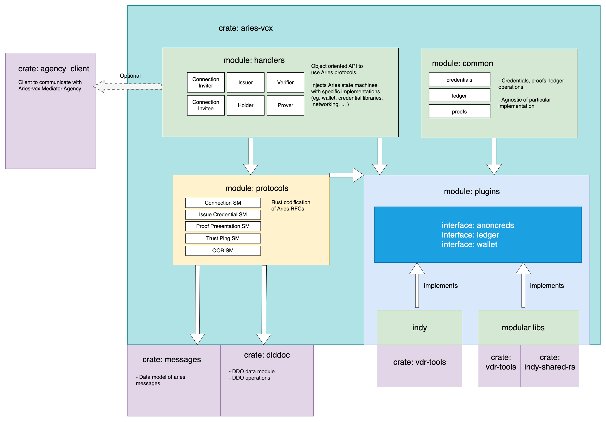

# aries-vcx
`aries-vcx` is more of a "library" rather than "framework". We strive to be not too
opinionated and simply provide building blocks for whatever you want to build.

You can use `aries-vcx` to build both end-user products (mobile wallets in role of credential
holder and prover) or server (typically in role of issuer, verifier).

Generally, the crate allows you to:
- create encrypted wallet,
- read/write from/to Indy ledger,
- establish didcomm connections and exchange messages,
- create and process Aries messages to drive Aries protocols.

## `aries-vcx` components
Additionally, the following crates may be consumed independently of `aries-vcx`:
- [messages](../messages) - crate for building and parsing Aries messages
- [diddoc](../diddoc) - crate to work with DIDDocs

### Deprecation notice: Message mediation
Aries-vcx contains built-in support for message mediation which is useful for mobile use cases. However,
this feature (implemented via `MediatedConnection`) is now deprecated as it is tied to mediator
implementation [vcxagency-node](https://github.com/AbsaOSS/vcxagencynode) which does not implement
Aries [pick-up protocol](https://github.com/hyperledger/aries-rfcs/tree/main/features/0685-pickup-v2).

# Getting started
To use `aries-vcx` in your project, you need to add GitHub dependency to your `Cargo.toml`, and best
define a version through a `tag`:
```toml
aries-vcx = { tag = "0.57.1", git = "https://github.com/hyperledger/aries-vcx" }
```
It's also advisable to follow these [instructions](TUTORIAL.md) to check your environment is properly configured.

# Projects built with aries-vcx
- [aries-vcx-agent](../agents/rust/aries-vcx-agent) - sample agent with local persistence. Used for cross-compatibility testing with other aries implementations.
- [unifii_aries_vcx](../uniffi_aries_vcx) - wrapper around `aries-vcx` to generate Swift and Kotlin wrappers for mobile use-cases

## Implemented Aries protocols
* ✅ Connection Protocol 1.0: [`https://didcomm.org/connections/1.0/*`](https://github.com/hyperledger/aries-rfcs/tree/master/features/0160-connection-protocol)
* ✅ Out of Band 1.1: [`https://didcomm.org/out-of-band/1.1/*`](https://github.com/hyperledger/aries-rfcs/blob/main/features/0434-outofband)
* ✅ Basic Message 1.0: [`https://didcomm.org/basicmessage/1.0/*`](https://github.com/hyperledger/aries-rfcs/tree/master/features/0095-basic-message)
* ✅ Credential Issuance 1.0 [`https://didcomm.org/issue-credential/1.0/*`](https://github.com/hyperledger/aries-rfcs/blob/master/features/0036-issue-credential)
* ✅ Credential Presentation 1.0: [`https://didcomm.org/present-proof/1.0/*`](https://github.com/hyperledger/aries-rfcs/tree/master/features/0037-present-proof)
* ✅ Trust Ping 1.0: [`https://didcomm.org/trust_ping/1.0/*`](https://github.com/hyperledger/aries-rfcs/blob/master/features/0048-trust-ping/README.md)
* ✅ Discover Features 1.0: [`https://didcomm.org/discover-features/1.0/*`](https://github.com/hyperledger/aries-rfcs/tree/master/features/0031-discover-features)
* ✅ Revocation notification 2.0: [`https://didcomm.org/revocation_notification/2.0/*`](https://github.com/hyperledger/aries-rfcs/tree/master/features/0031-discover-features)

### State machines guidelines
Please follow these [guidelines](./docs/guidelines.md) when implementing new state machines.

## Architecture


