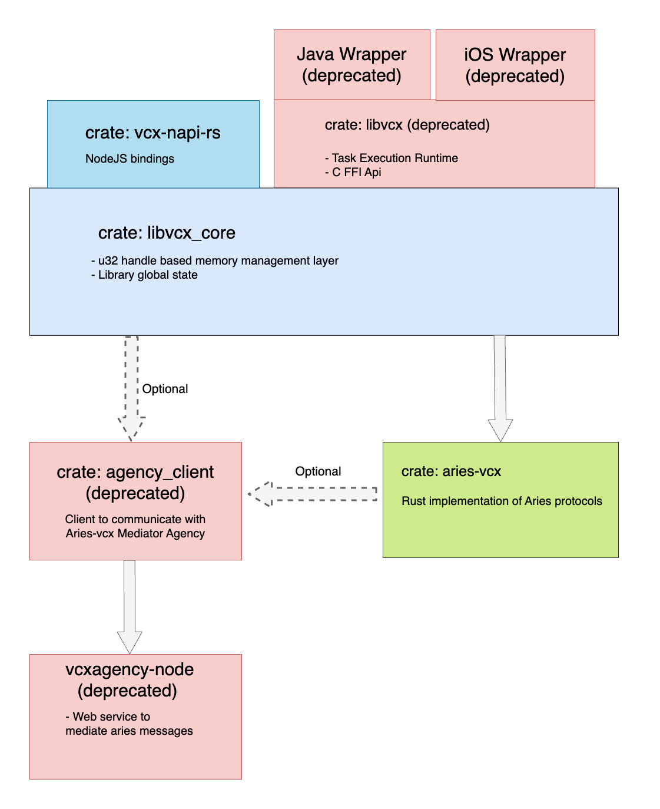

# <span style="color:red;background:white">Deprecation notice: libvcx</span>
This is now deprecated and receives limited maintenance support. 

This project used to provide C-API for creating bindings for languages other than Rust, primarily 
Java, iOS. However, this was started many years ago (circa 2018) and better approaches
to FFI has emerged since then. One of apparent leaders is `uniffi` which was developed by Mozilla and
handles many of the complexities that used to have to be managed manually in this project.

We encourage new developers to adopt this technology in favor of libvcx - we currently have new 
wrapper for `aries-vcx` in POC stage [uniffi_aries_vcx](../uniffi_aries_vcx), therefore you 
will have slower start, perhaps more frequent changes to sync up with, but much more promising 
long-term future.

# Libvcx
Libvcx is library built on top of `aries-vcx`, which provides a particular approach how to build bindings for 
other languages.

### Objective-C & Java wrappers
- Android and iOS packages are built with every [release](../docs/RELEASES.md).
- 
- 3rd party demos (possibly outdated)
  * Android [demo](https://github.com/sktston/vcx-demo-android) 
  * iOS [demo](https://github.com/sktston/vcx-demo-ios)
  * iOS [skeleton project](https://github.com/sktston/vcx-skeleton-ios)

# Testing
Before you try to build/test `libvcx` crate on your machine, make sure you can build `aries-vcx` - see 
[aries-vcx README](../aries_vcx).

- Run unit tests:
```
cargo test  --features "general_test" -- --test-threads=1
```
- Run integration tests (you need to have Indy pool running)
```
TEST_POOL_IP=127.0.0.1 cargo test  --features "pool_tests" -- --test-threads=1
```

## Architecture


