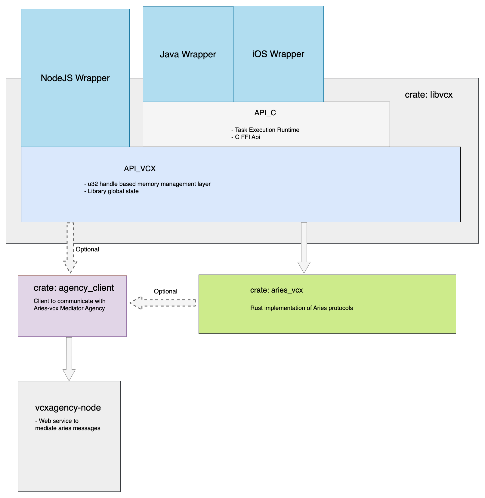

# Deprecation notice
This is now deprecated and receives limited maintenance support. 

This project used to provide C-API for creating bindings for languages other than Rust, primarily 
Java, iOS. However, this was started many years ago (circa 2018) and better approaches
to FFI has emerged since then. One of apparent leaders is `uniffi` developed by Mozilla which
handles lots of complexity which used to have to be done manually in this project.

We encourage new developers to adopt this technology in favor of libvcx - we currently have new 
wrapper for `aries-vcx` in POC stage [uniffi_aries_vcx](../uniffi_aries_vcx), therefore you 
will have slower start, perhaps more frequent changes to sync up with, but much more promising 
long-term future.

# Libvcx
- Libvcx is library built on top of `aries-vcx`, which provides a particular approach how to 
  build bindings for other languages.
- The library is split in 2 modules:

### `api_vcx` module
Layer on top of `aries-vcx` which provides `u32` "handle" reference API. When you
create a new object, this layer gives you back `u32` reference to that object, which is how you
work with it. This is shared layer for legacy approach of building wrappers.

### DEPRECATED:`api_c` module & Objective-C / Java wrappers
Built on top of `api_vcx`, provides runtime executor (tokio) and FFI interface. Libvcx based Java and 
iOS wrapper are linked to this interface.
If you wish to use iOS or Android wrapper, you may find it useful to have look at this 3rd party demos
* Android [demo](https://github.com/sktston/vcx-demo-android) 
* iOS [demo](https://github.com/sktston/vcx-demo-ios)
* iOS [skeleton project](https://github.com/sktston/vcx-skeleton-ios)

# Testing
Before you try to build/test `libvcx` crate on your machine, make sure yu can buil `aries-vcx` - see 
[aries-vcx README](../aries_vcx).

- Run unit tests:
```
cargo test  --features "general_test" -- --test-threads=1
```
- Run integration tests (you need to have Indy pool running)
```
TEST_POOL_IP=127.0.0.1 cargo test  --features "pool_tests" -- --test-threads=1
```

## Architecture


