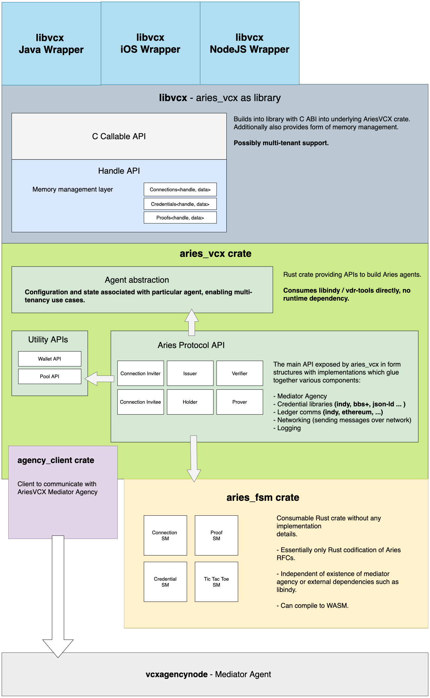

# A short history background
LibVCX was library donated into IndySDK by Evernym around 2018. At that point of time Aries did not yet
exist, and the library contained custom proprietary communication protocols of Evernym. In early 2020,
Evernym has contributed implementation of the main Aries protocols. Later on in summer 2020, Absa has 
decided to fork the library, deleted legacy code and worked on improving code quality. In October 2020, 
Absa's forked version was brought back under Hyperledger umbrella and rebranded to "AriesVCX".

The further development of the library can be split into a few phases, roughly marking important 
architectural milestones.

# Phase 0 - Done ✅
- We could call the phase from Absa's fork up until return to Hyperledger as Phase 0, the most of the 
code cleanup and code restructuring happened. We have
- ✅ deleted legacy code, 
- ✅ migrated CI to Github Actions (building docker, ios, android artifacts)
- ✅ changed library testing approach (favoring integration testing in language wrappers, removing 
  encrypted mock inputs on rust-level unit testing)
- ✅ thinned language wrappers (wrappers should use functions to access data, rather trying to map out 
  Rust data structures).

# Phase 1 - Done ✅
This phase is all about decoupling parts of the library into independent modules. We have decoupled 
the library into 3 pieces.
- ✅ `mediator agent client` - client for talking to a compatible agencies - the only open source 
  implementation available is [vcxagencynode](https://github.com/AbsaOSS/vcxagencynode).
- ✅ `aries-vcx` - the "glue" between Aries state machines, `libindy` and mediator agent.  
- ✅ `libvcx` - adds memory management and C bindings on top of `aries-vcx` - making it consumable
   on Android, iOS and any programming language.

# Phase 2 - In progress 🚧
- 🚧 Migration from `libindy` to its fork [vdr-tools](https://gitlab.com/evernym/verity/vdr-tools).
- 🚧 Concise `aries-vcx` crate API and start publishing on crates.io
- 🚧 Implement testing backchannel for aries-vcx. [WIP](https://github.com/hyperledger/aries-agent-test-harness/pull/243)
- Support for public DID-based connection invitations
- Support for [out-of-band protocol](https://github.com/hyperledger/aries-rfcs/tree/master/features/0434-outofband)

# Future work 

### AIP 2.0
Our current priority is to get satisfying AIP1.0 results
  on [aries-agent-test-harness](https://github.com/hyperledger/aries-agent-test-harness) tests, 
  followed by support for AIP 2.0 in the future.
  
### Multitenancy 
AriesVCX currently can not manage more than 1 wallet simultaneously. Adding this capability is on our roadmap.

# Future vision architecture diagram
# 

